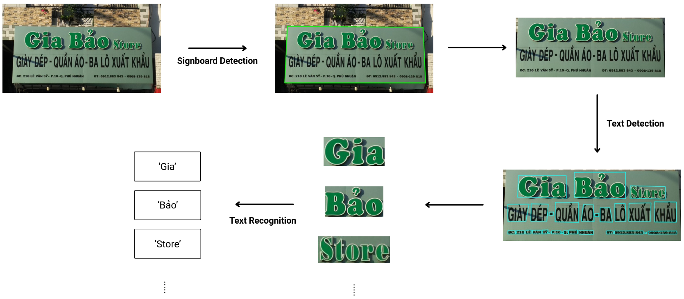

<h1 align="center">
Text Detection and Recognition on Signboard in Vietnamese Street-View Video
</h1>

<p align="center">


</p>

This project addresses the problem of detecting and recognizing signboard text in urban street-view images and videos, with a focus on Vietnamese environments. Signboard text often contains important semantic information such as business names and service types, which can support applications like urban business analysis and intelligent navigation. However, this task is challenging due to complex backgrounds, diverse signboard layouts, motion blur in dashcam videos, and the presence of Vietnamese diacritics. To tackle these challenges, this work builds an **end-to-end pipeline** consisting of three stages: signboard detection, text detection, and text recognition. The pipeline integrates **RT-DETRv2** for signboard detection, **YOLOv8-OBB** for oriented text detection, and **PARSeq** for text recognition. Experiments are conducted on an extended SignboardText dataset, with evaluation focused on Vietnamese street scenarios. The proposed pipeline achieves an Hmean of **89.64%** on **VietSignboard** and **89.79%** on **VinText** for text detection, and end-to-end recognition Hmean scores of **72.32%** and **72.23%**, respectively. These results demonstrate the effectiveness of the proposed pipeline and provide a practical baseline for urban text information extraction from street-view images and videos.

## 🚀 Pipeline
<p align="center">
  
</p>

## 📊 Dataset
Please refer to the official dataset repository for details about the dataset structure and instructions on how to request and download the dataset:

[Dataset](https://github.com/aiclub-uit/SignboardText/blob/main/README.md)

## ⚙️ Installation
First, create a virtual environment using Conda:
```bash
conda create -n myvenv python=3.10
conda activate myvenv
```
Then, install the required dependencies:
```bash
pip install -r requirements.txt
```

## 🏋️ Training
Model training is implemented using **PyTorch Lightning** and **Hugging Face Transformers**, while several components are adapted from their **official repositories**. All models are fine-tuned on the SignboardText dataset.

Initial experiments were conducted on **Kaggle notebooks** with GPU acceleration. The training scripts in this repository reproduce the same setup and allow users to fine-tune the models locally.

Example command for training the RT-DETRv2 signboard detection model:

```bash
python3 signboard_det/rtdetr_v2.py -mode train -epochs 100 -size 640
```
> 💡 To enable experiment tracking, set your WANDB_API_KEY before running the training script.

## Signboard Detection
Due to the domain gap between standard object detection datasets and real-world Vietnamese street scenes, all models are fine-tuned on our dataset. The models are grouped into three categories based on their output representation: **axis-aligned bounding boxes**, **oriented bounding boxes (OBB)**, and **polygon-based segmentation**. This categorization allows systematic evaluation of different approaches for signboard detection in complex urban environments.
### Fine-tuned Models with Axis-Aligned Bounding Boxes
| Model     | Params(M)  | FPS   | mAP@50 (%) | mAP@50-95 (%) | Reference | Link to model |
|-----------|:----------:|:-----:|:----------:|:-------------:|:---------:|:---------------:|
| DETR      | 41.50      | 42.82 | 89.30      | 68.95         | [link](https://github.com/facebookresearch/detr/blob/main/README.md) | [link](https://drive.google.com/file/d/1oglSNw-P92CEnGcY12cvvsEntri_6wP2/view?usp=drive_link) |
| YOLOv8    | 3.01       | 133.01| 86.85      | 74.20         | [link](https://github.com/ultralytics/ultralytics/blob/main/README.md) | [link](https://drive.google.com/file/d/13mv2OwbUL5iXo0YIes1DW-o6WvQcsMXm/view?usp=drive_link) |
| RT-DETRv2 | 42.73      | 26.44 | 90.71      | 81.22         | [link](https://github.com/lyuwenyu/RT-DETR/blob/main/README.md) | [link](https://drive.google.com/file/d/1hr_Jz8Z2hKHabRIlrJ2Aj0_mCv0pDwno/view?usp=drive_link) |
| YOLOv11   | 2.59       | 96.06 | 88.00      | 73.47         | [link](https://github.com/ultralytics/ultralytics/blob/main/README.md) | [link](https://drive.google.com/file/d/1WZesCdwKxj40mdCNDC0JhHEc_H8VFl8C/view?usp=drive_link) |

### Fine-tuned Models with Oriented Bounding Boxes (OBB)
| Model       | Params(M)  | FPS   | mAP@50 (%) | mAP@50-95 (%) | Reference | Link to model |
|-------------|:----------:|:-----:|:----------:|:-------------:|:---------:|:---------------:|
| YOLOv8-OBB  | 3.01       | 133.01| 93.04      | 79.08         | [link](https://github.com/ultralytics/ultralytics/blob/main/README.md) | [link](https://drive.google.com/file/d/1KglF8Yi_uasFQc6pJ71p7qrVus1EHiME/view?usp=drive_link) |
| YOLOv11-OBB | 2.59       | 96.06 | 93.20      | 80.78         | [link](https://github.com/ultralytics/ultralytics/blob/main/README.md) | [link](https://drive.google.com/file/d/1tJUTAJRmIf9Vs8uGxh4GRgyBnOinXQzY/view?usp=drive_link) |

### Fine-tuned Polygon-Based Models
| Model       | Params(M)  | FPS  | mIoU (%) | mAccuracy (%) | Reference | Link to model |
|-------------|:----------:|:----:|:--------:|:-------------:|:---------:|:---------------:|
| SegFormer   | 3.8        | 97.5 | 89.03    | 93.92         | [link](https://github.com/NVlabs/SegFormer/blob/master/README.md) | [link](https://drive.google.com/file/d/1Ci6EF3DUxJ0gpdhaDk5uWfjm7kn-EUvp/view?usp=drive_link) |
| Mask2Former | 47.4       | 15.9 | 90.48    | 94.44         | [link](https://github.com/facebookresearch/Mask2Former/blob/main/README.md) | [link](https://drive.google.com/file/d/1Yd-fEMCUe_fyc2ByDkcTI1VNXh3xTwO-/view?usp=drive_link) |

> **💡 Signboard Alignment**: For OBB and polygon-based models, we further experiment with a **perspective transformation** step to normalize skewed signboards before text detection and recognition. This alignment aims to reduce geometric distortion and improve downstream task performance. Preliminary results show promising improvements, especially for signboards with extreme angles or irregular shapes.

## Text Detection and Recognition
To optimize the trade-off between **performance** and **inference speed**, we first evaluate multiple pre-trained models on our dataset. Based on this evaluation, we select the best-performing models for fine-tuning. Models are compared across different paradigms: **word-level** vs **line-level detection**, and **one-stage** vs **two-stage** text spotting.

### Pretrained Text Detection Models
#### Word-Level Evaluation
| Models  | Params(M) | **Vietsignboad** |        |        | **IC15-TT** |        |        | **VinText** |        |        | FPS  | Reference | Link to pretrained model |
|---------|:---------:|:----------------:|:------:|:------:|:-----------:|:------:|:------:|:-----------:|:------:|:------:|:----:|:---------:|:------------------------:|
|         |           | Precision        | Recall | H-mean | Precision   | Recall | H-mean | Precision   | Recall | H-mean |      |           |                          |
| PANet   | 12.25     | 81.00            | 82.25  | 81.62  | 61.00       | 72.56  | 66.28  | 81.71       | 75.82  | 78.66  | 11.58| [link](https://github.com/czczup/FAST/blob/main/README.md) | [link](https://drive.google.com/file/d/13m7hPZ8mhffaQwch_U6XPOvIG2ouNKHD/view) |
| DBNet++ | 26.43     | 89.86            | 80.31  | 84.82  | 73.38       | 60.95  | 65.59  | 91.52       | 74.18  | 81.94  | 18.69| [link](https://github.com/frotms/PaddleOCR2Pytorch/blob/main/README.md) | [link](https://drive.google.com/file/d/1fC64s4wkNQm5yh11A2qbeklfZr-BGRS0/view?usp=drive_link) |
| TextPMs | 36.43     | 90.27            | 84.85  | 87.48  | 78.82       | 77.58  | 78.20  | 93.41       | 81.32  | 86.95  | 20.75| [link](https://github.com/GXYM/TextPMs/blob/master/README.md) | [link](https://drive.google.com/file/d/1JKVqjZAZs4mckhH7KiC7sNDqUw8Ib1Km/view) |
| FAST    | 10.58     | 83.98            | 86.32  | 85.13  | 64.34       | 80.25  | 71.42  | 84.45       | 79.09  | 81.69  | 15.30| [link](https://github.com/czczup/FAST/blob/main/README.md) | [link](https://github.com/czczup/FAST/releases/download/release/fast_base_ic15_1280_finetune_ic17mlt.pth) |
| KPN     | 58.24     | 81.19            | 81,85  | 81.52  | 63.49       | 85.90  | 73.01  | 83.49       | 78.37  | 80.85  | 4.17 | [link](https://github.com/GXYM/KPN/blob/main/README.md) | [link](https://drive.google.com/file/d/1WvJUTggqYXBkKtu3vSvIJQ_A7b7ZYER9/view) |

#### Line-Level Evaluation
| Models  | Params(M) | **Vietsignboad** |        |        |
|---------|:---------:|:----------------:|:------:|:------:|
|         |           | Precision        | Recall | H-mean |
| PANet   | 21.68     | 74.62            | 33.60  |        |
| DBNet++ | 22.14     | 70.54            | 33.70  |        |
| TextPMs | 22.84     | 75.27            | 35.04  |        |
| FAST    | 21.91     | 79.92            | 34.39  |        |
| KPN     | 25.23     | 78.48            | 38.18  |        |

### Pretrained Text Recognition Models
| Model    | Params(M) | VietSignboard       |                     | IC15-TT       |               | VinText       |               | Speed(ms) | Reference | Link to pretrained model |
|----------|:---------:|:-------------------:|:-------------------:|:-------------:|:-------------:|:-------------:|:-------------:|:---------:|:---------:|:------------------------:|
|          |           | Word                | Line                | Word          | Line          | Word          | Line          |           |        |         | 
| ViTSTR   | 85.48     | 56.70               | 29.01               | 48.71         | -             | 50.82         | -             | 9.80      | [link](https://github.com/roatienza/deep-text-recognition-benchmark/blob/master/README.md) | [link](https://github.com/roatienza/deep-text-recognition-benchmark/releases/download/v0.1.0/vitstr_base_patch16_224_aug.pth) |
| PARSeq   | 23.83     | 80.76               | 59.08               | 78.28         | -             | 72.96         | -             | 12.71     | [link](https://github.com/baudm/parseq/blob/main/README.md) | [link](https://github.com/baudm/parseq/releases/download/v1.0.0/parseq-bb5792a6.pt) |
| CDistNet | 65.46     | 63.25               | 42.43               | 68.13         | -             | 56.39         | -             | 120.33    | [link](https://github.com/simplify23/CDistNet/blob/master/README.md) | [link](https://drive.google.com/file/d/1tmsaY9iiymqFGbY1Eq_tdzHegXjYW1qc/view?usp=drive_link) |
| SMTR     | 15.82     | 79.58               | 64.54               | 76.77         | -             | 70.64         | -             | 23.47     | [link](https://github.com/Topdu/OpenOCR/blob/main/README.md) | [link](https://drive.google.com/file/d/16a9scNIaLLlG6Yj7weokXRDo4w9G5qDZ/view) |
| SVTRv2   | 21.02     | 80.82               | 65.64               | 78.33         | -             | 72.34         | -             | 18.81     | [link](https://github.com/Topdu/OpenOCR/blob/main/README.md) | [link](https://drive.google.com/file/d/1P56B_PVYBF649zUqQFShuAZC1XuNmUcL/view?usp=drive_link) |

### End-to-End Text Recognition: One-Stage vs Two-Stage
| Model    | Params(M) | VietSignboard       |                     | IC15-TT       |               | VinText       |               | FPS       | Reference | Link to pretrained model |
|----------|:---------:|:-------------------:|:-------------------:|:-------------:|:-------------:|:-------------:|:-------------:|:---------:|:---------:|:------------------------:|
|          |           | Word                | Line                | Word          | Line          | Word          | Line          |           |        |         | 
| TESTR           | 49.48     | 48.77               | 7.43                | 60.43         | -             | 50.11         | -             | 11.11| [link](https://github.com/mlpc-ucsd/TESTR/blob/main/README.md) | [link](https://ucsdcloud-my.sharepoint.com/:u:/g/personal/xiz102_ucsd_edu/ETwRegsVcwtNgnbjm-79XqQBkQgjsRwIUedJysUz8Fm6wA?e=yKR2mN) |
| DeepSolo        | 42.59     | 47.61               | 8.02                | 70.71         | -             | 53.32         | -             | 12.21| [link](https://github.com/ViTAE-Transformer/DeepSolo/blob/main/DeepSolo/README.md) | [link](https://1drv.ms/u/s!AimBgYV7JjTlgcdonZXu6_JtW2QMuA?e=8BTzmi) |
| UNITS           | 101.00    | 63.19               | 9.75                | 88.00         | -             | 64.88         | -             | 1.28 | [link](https://github.com/clovaai/units/blob/main/README.md) | [link](https://drive.google.com/file/d/1c76n9QvysA30q31KMzrDoa7I9bqLuBSa/view?usp=sharing) |
| DNTextSpotter   | 42.73     | 49.17               | 9.20                | 73.20         | -             | 53.57         | -             | 12.40| [link](https://github.com/yyyyyxie/DNTextSpotter/blob/main/README.md) | [link](https://drive.google.com/file/d/1xwzd0qxIBLIM2rqx_S6_nBSiX-UiIrLa/view?usp=drive_link) |
| TextPMs + SVTRv2| 57.45     | 66.48               | 9.79                | 68.59         | -             | 68.50         | -             | 10.21| - | - |

Based on the experimental results and our evaluation criteria (balancing accuracy and inference speed), we adopt a word-level strategy combined with a two-stage pipeline (text detection + text recognition). Accordingly, we select several promising models that offer optimal accuracy-speed trade-offs for fine-tuning. The following tables present the fine-tuned results of text detection and text recognition models.

### Fine-tuned Text Detection Models (Word-Level)
| Models       | **Vietsignboad** |        |        | **IC15-TT** |        |        | **VinText** |        |        | Link to model |
|--------------|:----------------:|:------:|:------:|:-----------:|:------:|:------:|:-----------:|:------:|:------:|:-------------:|
|              | Precision        | Recall | H-mean | Precision   | Recall | H-mean | Precision   | Recall | H-mean |               |
| DBNet++      | 90.40            | 81.94  | 85.96  | 84.42       | 61.75  | 71.33  | 92.22       | 76.34  | 83.53  | [link](https://drive.google.com/file/d/1fNZE10OsiId4lsrT-L2lcyRr9I9j-dPo/view?usp=drive_link) |
| TextPMs      | 90.36            | 85.29  | 87.75  | 83.80       | 82.39  | 83.09  | 92.98       | 84.46  | 88.51  | [link](https://drive.google.com/file/d/1-9yhDv1nr5JcJS4AadYf9-Lm0noh20Ls/view?usp=sharing) |
| YOLOv8-OBB   | 91.14            | 83.94  | 87.39  | 83.77       | 81.42  | 82.58  | 93.34       | 77.57  | 84.73  | [link](https://drive.google.com/file/d/1Xnjh9AKK0O5RlYfcdkwInbPiYEz-79n4/view?usp=drive_link) |
| YOLOv11-OBB  | 91.49            | 82.97  | 87.02  | 84.16       | 78.70  | 81.34  | 93.10       | 76.84  | 84.19  | [link](https://drive.google.com/file/d/1_aa8ugWLPygdJfRTRkrJRjSKycqK9TM7/view?usp=drive_link) |

### Fine-tuned Text Recognition Models (Word-Level)
| Model  | VietSignboard |            | IC15-TT       |            | VinText       |            | Link to model |
|--------|:-------------:|:----------:|:-------------:|:----------:|:-------------:|:----------:|:-------------:|
|        | Exact-match   | Norm-match | Exact-match   | Norm-match | Exact-match   | Norm-match |               |
| PARSeq | 79.19         | 80.26      | 60.68         | 62.11      | 76.95         | 78.67      | [link](https://drive.google.com/file/d/1XkaCFx9NWkf_oAO0yIeTR4gohqEVa1of/view?usp=drive_link) |
| SMTR   | 77.40         | 78.47      | 59.64         | 61.07      | 75.06         | 76.58      | [link](https://drive.google.com/file/d/1ondg31F3aoGyATP7ttwxO0IdEjzKYMBw/view?usp=drive_link) |
| SVTRv2 | 76.39         | 77.96      | 57.55         | 58.59      | 76.46         | 78.10      | [link](https://drive.google.com/file/d/19xqFaw_acEIeEBBlGRH_ecxaF4zQVtW2/view?usp=drive_link) |

## 🔗 End-to-End Pipeline
After fine-tuning the three sub-tasks, including signboard detection, text detection, and text recognition, we combine the best-performing models from each component to construct several candidate pipelines. We then evaluate these pipelines in an end-to-end setting to identify the most effective configuration for signboard text extraction. The following tables present the performance of different pipeline combinations on the VietSignboard, IC15-TT, and VinText datasets.
### Text Detection on Signboard
| Model | | | VietSignboard |  |  | IC15-TT | | | VinText | | | 
|------ |:----------------:|:--------------:|:------------:|:------------:|:------------:|:------------:|:------------:|:--------------:|:----------:|:---------------:|:------------:|
| Signboard Det | Text Det | Text Rec | Precision | Recall | H-mean | Precision | Recall | H-mean | Precision | Recall | H-mean |
| RT-DETRv2 | YOLOv8-OBB | PARSeq | 91.79 | 87.59 | 89.64 | 80.13 | 72.16 | 75.94 | 92.41 | 87.32 | 89.79 | 
| YOLOv11-OBB | YOLOv8-OBB | PARSeq | 89.34 | 86.76 | 88.03 | 73.47 | 67.54 | 70.38 | 89.39 | 85.59 | 87.45 | 
| SegFormer | YOLOv8-OBB | PARSeq | 88.31 | 87.30 | 87.80 | 75.33 | 80.25 | 77.72 | 88.21 | 87.44 | 87.82 | 
| YOLOv11-OBB + Align | YOLOv8-OBB | PARSeq | 89.78 | 86.79 | 88.26 | 73.48 | 67.41 | 70.32 | 89.25 | 85.33 | 87.25 | 
| SegFormer + Align | YOLOv8-OBB | PARSeq | 90.64 | 85.52 | 88.00 | 75.44 | 71.18 | 73.25 | 89.55 | 86.32 | 87.90 | 
### End-to-End Text Recognition on Signboard
| Model | | | VietSignboard |  | IC15-TT | | VinText | |
|------ |:----------------:|:--------------:|:------------:|:------------:|:------------:|:------------:|:------------:|:--------------:|
| Signboard Det | Text Det | Text Rec | Exact-match | Norm-match | Exact-match | Norm-match | Exact-match | Norm-match |
| RT-DETRv2 | YOLOv8-OBB | PARSeq | 71.36 | 72.32 | 48.68 | 49.70 | 70.35 | 72.23 |
| YOLOv11-OBB | YOLOv8-OBB | PARSeq | 70.23 | 71.19 | 41.65 | 42.66 | 69.00 | 70.69 | 
| SegFormer | YOLOv8-OBB | PARSeq | 69.94 | 70.94 | 48.92 | 49.67 | 69.30 | 70.91 | 
| YOLOv11-OBB + Align | YOLOv8-OBB | PARSeq | 70.46 | 71.43 | 41.69 | 42.70 | 68.32 | 70.02 | 
| SegFormer + Align | YOLOv8-OBB | PARSeq | 70.25 | 71.19 | 44.80 | 46.02 | 70.12 | 71.65 | 

> 📌 **Note**: **IC15-TT** denotes a merged subset of **ICDAR2015** and **Total-Text** datasets.
## 🎬 Demo

## 🙏 Acknowledgements
This project builds upon several excellent open-source projects. We thank the authors for making their code publicly available.